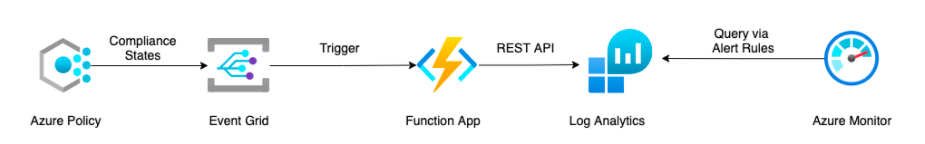

# Introduction

This is a monitoring and email alerting solution for Non-Compliant resources in Azure.

## Resources details

The list of resources created by this Terraform Project are as follows : -

- Log Analytics Workspace
- App Service Plan
- Application Insights
- Storage Account
- Function App

## Diagram

Here's a rough diagram of the resources this project creates



## Operations details

The **main.tf** creates the Resource Group and call each modules for creating the required resources. The **terraform.auto.tfvars** file contains variable values for all resources.

## Deployment Steps

The deployment steps are as follows

1. Deploy the Terraform Code
2. Deploy the Function
3. Create the Event Grid Topic and Subscription
4. Create the Monitoring Rules

### Deploy the Terraform Code

Fire the below command to create the resources using Terraform script

> terraform plan

> terraform apply

### Deploy the Function

The most common way to deploy a function in Azure is using Visual Studio Code. You can find the steps [here](https://docs.microsoft.com/en-us/azure/azure-functions/functions-develop-vs-code?tabs=python#publish-to-azure)

### Create the Event Grid Topic and Subscription

- Search and Click on **Event Grid System Topics** from Azure portal.
- Click on **Create** button
- Fill in the required fileds. Ensure to select **Topic Types** as **Microsoft PolicyInsights**
- Click on **Next Button** and provide tags (optional)
- Click on **Review+Create**

- Click on the newly created Event Grid System Topic and click on **+ Event Subscription**
- Provide the required details. Select **Event Schema** as **Event Grid Schema**, select all the three options (Policy Compliance State Changed, Policy Compliance State Deleted and Policy Compliance State Created) for **Filter to Event Types**, Select **Azure Function** as **Event Types** and then select the function.
- Click on Create button

### Create the Monitoring Rules

- From Azure **Monitor** portal click on **Create** button
- Select the Scope select the Log Analytics Workspace created using the Terraform. Click on **Condition**.
- Select **Custom log search** in **Select a Signal Page**. Paste the following Log Analytics Kusto Query in the box. Click on **Continue Editing Alert**

```
PolicyInsights_CL
| where event_type_s =~ "Microsoft.PolicyInsights.PolicyStateCreated" or event_type_s =~ "Microsoft.PolicyInsights.PolicyStateChanged"
| where data_complianceState_s =~ "NonCompliant"
| extend Time_Stamp=data_timestamp_t
| extend Resource_Id = subject_s
| extend Subscription_Id = data_subscriptionId_g
| extend Compliance_state = data_complianceState_s
| extend Policy_Definition = data_policyDefinitionId_s
| extend Policy_Assignment = data_policyAssignmentId_s
| extend Compliance_Reason_Code = data_complianceReasonCode_s
| project Time_Stamp, Resource_Id, Subscription_Id, Policy_Assignment, Policy_Definition, Compliance_state, Compliance_Reason_Code
```

- In the **Measurement** section select **Table Rows** as Measure, **Count** as Aggregation Type and **5 minutes** as Aggregation granularity.
- In the **Alert Logic** section select **Greater than** as Operator, select your **Threshold** value as per your requirement and select **5 minutes** as frequency of evaluation. Click **Next: Actions**
- Select your **Action Group** and click on **Next: Details**
- Provide the basic details and click on **Next: Tags**
- Click on **Review + Create**