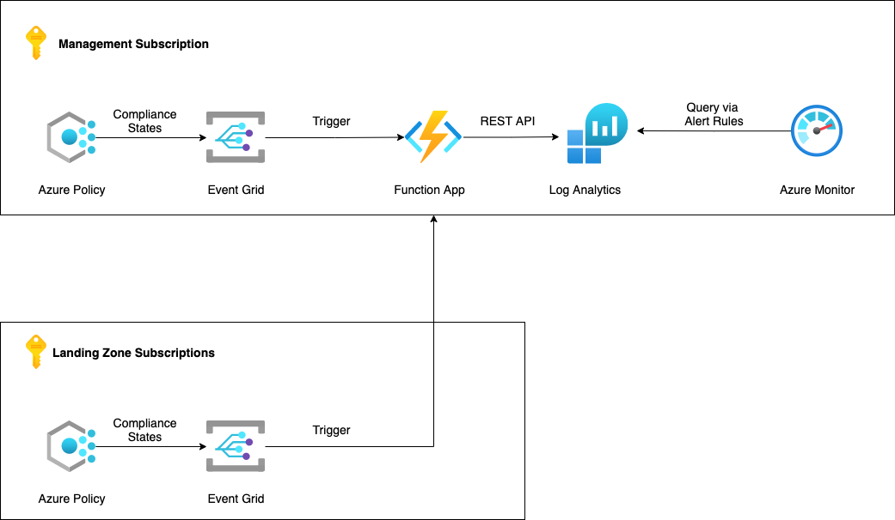

# Overview

This bicep code is developed to automate deployment of a Azure Non-Compliance resource monitoring solution. The solution is a split solution with bicep code creating the solution with the following sequence

1. Create all resources except Event Grid Topic and Subscription
2. Deploy the Azure Function (Manual or via AZ CLI / Azure Pipeline / VSCode)
3. Create the Event Grid Topic and Subscription

## Resources details

The list of resources created by this Terraform Project are as follows : -

- Log Analytics Workspace
- Event Grid Topic and Subscription
- Function App (Triggered Manually using AZ CLI or from VSCode)
- Azure Monitor Alert Rule
- Storage Account
- Azure Monitor Metrics
- Key Vault
- App Service Plan
- Application Insights
- Storage Account
- Function App

## Diagram

Here's a rough diagram of the resources this project creates



## Understanding the Code

The provider config for backend. You need to replace "<Your Value here>" with your own values.

```
  backend "azurerm" {
    resource_group_name  = "<Your Value here>"
    storage_account_name = "<Your Value here>"
    container_name       = "<Your Value here>"
    key                  = "<Your Value here>"
  }
```

## Deploying the Function app

### Deploying using Azure DevOps Pipeline

Define the variable. Change the **functionAppName** as per your requirement

```
variables:
  functionWorkingDirectory: 'function'
  functionAppName: 'FN-PolicyMonitor'
```

Archive the function directory

```
- task: ArchiveFiles@2
    displayName: 'Archive Function directory'
    inputs:
    rootFolderOrFile: $(functionWorkingDirectory)
    includeRootFolder: false
    archiveType: zip
    archiveFile: $(Build.ArtifactStagingDirectory)/monitor.zip
    replaceExistingArchive: true
- publish: $(Build.ArtifactStagingDirectory)/monitor.zip
    artifact: drop
```

Deploy the Function App

```
- task: AzureFunctionApp@1
    displayName: 'Azure functions app deploy'
    inputs:
        appType: functionAppLinux
        appName: $(functionAppName)
        package: '$(Pipeline.Workspace)/drop/monitor.zip'
```
### Deploy using AZ cli

```
az functionapp deploy --resource-group <Reosurce group Name> --name <Function App Name> --src-path <Path to the zip file> --type zip
```

### Deploy using Powershell

```
$creds = Invoke-AzureRmResourceAction -ResourceGroupName <Reosurce group Name> -ResourceType Microsoft.Web/sites/config -ResourceName <App Name>/publishingcredentials -Action list -ApiVersion 2015-08-01 -Force

$username = $creds.Properties.PublishingUserName

$password = $creds.Properties.PublishingPassword

$base64AuthInfo = [Convert]::ToBase64String([Text.Encoding]::ASCII.GetBytes(("{0}:{1}" -f $username,$password)))

$apiUrl = "https://<yourFunctionApp>.scm.azurewebsites.net/api/zip/site/wwwroot"

$filePath = "<yourFunctionName>.zip"

Invoke-RestMethod -Uri $apiUrl -Headers @{Authorization=("Basic {0}" -f $base64AuthInfo)} -Method PUT -InFile $filePath -ContentType "multipart/form-data"
```

### Install Azure CLI

You can install Azure CLI from [here](https://docs.microsoft.com/en-us/cli/azure/install-azure-cli)

### Authenticate Azure CLI

Hit the command **az login** from Comamnd Prompt or Terminal depending upon your OS. More details can be found [here](https://docs.microsoft.com/en-us/cli/azure/get-started-with-azure-cli)

### Trigger Manually

Fire the below command to create the resources using Bicep script


> terraform plan
> terraform apply

The **main.tf** creates the Resource Group and call each modules for creating the required resources. The **terraform.auto.tfvars** file contains variable values for all resources.

## Deployment Steps

The deployment steps are as follows

1. Deploy the Terraform Code
2. Deploy the Function
3. Create the Event Grid Topic and Subscription
4. Create the Monitoring Rules

### Deploy the Terraform Code

Fire the below command to create the resources using Terraform script

> terraform plan

> terraform apply

### Deploy the Function

The most common way to deploy a function in Azure is using Visual Studio Code. You can find the steps [here](https://docs.microsoft.com/en-us/azure/azure-functions/functions-develop-vs-code?tabs=python#publish-to-azure)

### Create the Event Grid Topic and Subscription

- Search and Click on **Event Grid System Topics** from Azure portal.
- Click on **Create** button
- Fill in the required fileds. Ensure to select **Topic Types** as **Microsoft PolicyInsights**
- Click on **Next Button** and provide tags (optional)
- Click on **Review+Create**

- Click on the newly created Event Grid System Topic and click on **+ Event Subscription**
- Provide the required details. Select **Event Schema** as **Event Grid Schema**, select all the three options (Policy Compliance State Changed, Policy Compliance State Deleted and Policy Compliance State Created) for **Filter to Event Types**, Select **Azure Function** as **Event Types** and then select the function.
- Click on Create button

### Create the Monitoring Rules

- From Azure **Monitor** portal click on **Create** button
- Select the Scope select the Log Analytics Workspace created using the Terraform. Click on **Condition**.
- Select **Custom log search** in **Select a Signal Page**. Paste the following Log Analytics Kusto Query in the box. Click on **Continue Editing Alert**

```
PolicyInsights_CL
| where event_type_s =~ "Microsoft.PolicyInsights.PolicyStateCreated" or event_type_s =~ "Microsoft.PolicyInsights.PolicyStateChanged"
| where data_complianceState_s =~ "NonCompliant"
| extend Time_Stamp=data_timestamp_t
| extend Resource_Id = subject_s
| extend Subscription_Id = data_subscriptionId_g
| extend Compliance_state = data_complianceState_s
| extend Policy_Definition = data_policyDefinitionId_s
| extend Policy_Assignment = data_policyAssignmentId_s
| extend Compliance_Reason_Code = data_complianceReasonCode_s
| project Time_Stamp, Resource_Id, Subscription_Id, Policy_Assignment, Policy_Definition, Compliance_state, Compliance_Reason_Code
```

- In the **Measurement** section select **Table Rows** as Measure, **Count** as Aggregation Type and **5 minutes** as Aggregation granularity.
- In the **Alert Logic** section select **Greater than** as Operator, select your **Threshold** value as per your requirement and select **5 minutes** as frequency of evaluation. Click **Next: Actions**
- Select your **Action Group** and click on **Next: Details**
- Provide the basic details and click on **Next: Tags**
- Click on **Review + Create**
